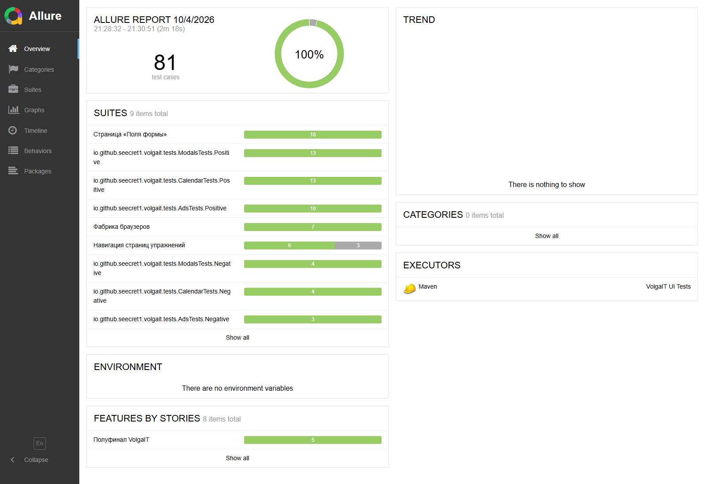
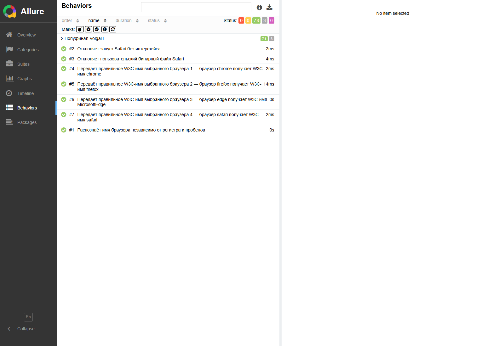

# VolgaIT — UI-автотесты полуфинала

Проект автоматизирует проверку учебного сайта [Practice Automation](https://practice-automation.com/) для полуфинала дисциплины «Автоматизация тестирования (Java, Python)».

В набор входят **81 проверка**:

- 74 UI-теста страниц Calendars, Modals, Ads, Form Fields и общей навигации;
- 7 модульных проверок фабрики браузеров;
- 6 параллельных потоков по умолчанию;
- Chrome, Firefox, Edge и Safari локально или через Selenium Grid;
- Allure-отчёт со скриншотом, HTML страницы и причиной при падении.

Последний локальный прогон в headless Chrome: **78 Passed, 3 Skipped, 0 Failed**. Три пропуска относятся к загрузке внешних YouTube-роликов; сами ссылки, их адреса, новая вкладка и переход на домен YouTube при этом проверены.



## Технологии и архитектура

- Java 17, Selenium 4, JUnit 5 и Maven;
- Allure для отчётности;
- **Page Object**: `CalendarPage`, `ModalsPage`, `AdsPage`, `FormFieldsPage`;
- **Component Object**: `NavigationComponent`, `PopupComponent`, `ContactFormComponent`;
- **Factory**: `DriverFactory` создаёт изолированный WebDriver для каждого теста;
- **Builder**: `ContactData.Builder` формирует данные контактной формы;
- **JUnit Extension**: `ScreenshotExtension` добавляет диагностические вложения в Allure;
- **External Configuration**: URL, вводимые значения, ожидаемые тексты и настройки запуска вынесены в `application.conf`.

Элементы Page/Component Objects объявлены через Selenium `@FindBy`. Для локаторов используются классы и короткие XPath, привязанные к устойчивой структуре страницы. Неявные ожидания и `Thread.sleep` не применяются: синхронизация построена на явных ожиданиях состояния DOM.

```text
src/test/java/io/github/seecret1/volgait
├── components   # переиспользуемые компоненты страниц
├── config       # чтение application.conf и системных параметров
├── constants    # DOM-атрибуты, runtime-ключи и метаданные
├── driver       # BrowserType, DriverFactory и его тесты
├── extensions   # вложения Allure при ошибке
├── model        # данные формы и Builder
├── pages        # Page Objects
├── tests        # JUnit 5 UI-тесты
└── utils        # переиспользуемые наборы тестовых параметров
```

## Требования

- Java 17 или новее;
- Maven 3.9+ либо Maven Wrapper из репозитория;
- хотя бы один поддерживаемый браузер;
- Docker — только для контейнерного запуска.

Selenium Manager автоматически подбирает драйвер браузера. Вручную скачивать ChromeDriver, GeckoDriver или EdgeDriver обычно не требуется.

## Запуск тестов

### Весь набор

Windows PowerShell:

```powershell
.\mvnw.cmd clean test
```

Если Maven установлен глобально:

```powershell
mvn clean test
```

Linux/macOS:

```bash
./mvnw clean test
```

По умолчанию тесты идут в headless Chrome. Чтобы видеть шесть одновременно работающих браузеров:

```powershell
.\mvnw.cmd clean test "-Dheadless=false"
```

### Выбор браузера

```powershell
.\mvnw.cmd clean test "-Dbrowser=chrome"
.\mvnw.cmd clean test "-Dbrowser=firefox"
.\mvnw.cmd clean test "-Dbrowser=edge"
.\mvnw.cmd clean test "-Dbrowser=safari" "-Dheadless=false"
```

Safari поддерживается только на macOS. Перед первым запуском нужно разрешить Remote Automation командой `safaridriver --enable`.

Прогон в нескольких локальных браузерах:

```powershell
foreach ($browser in 'chrome', 'firefox', 'edge') {
    .\mvnw.cmd test "-Dbrowser=$browser"
    if ($LASTEXITCODE -ne 0) { throw "Tests failed: $browser" }
}
```

### Отдельный класс, метод или группа

```powershell
.\mvnw.cmd test "-Dtest=FormFieldsTests"
.\mvnw.cmd test "-Dtest=FormFieldsTests#successful_submit_shows_alert_and_resets_form"
.\mvnw.cmd test "-Dgroups=positive"
.\mvnw.cmd test "-Dgroups=negative"
```

### Selenium Grid

```powershell
.\mvnw.cmd clean test `
  "-Dbrowser=firefox" `
  "-DremoteUrl=http://localhost:4444"
```

Если браузер на Grid расположен не по стандартному пути, можно передать `-DbrowserBinary=/path/to/browser`.

## Параллельное выполнение

JUnit 5 параллельно запускает классы и методы в фиксированном пуле из 6 потоков. Каждый тест получает собственный WebDriver, поэтому состояние браузера между сценариями не разделяется.

Настройки по умолчанию находятся в `src/test/resources/junit-platform.properties`. Число потоков можно изменить из команды:

```powershell
.\mvnw.cmd clean test `
  "-Djunit.jupiter.execution.parallel.config.fixed.parallelism=4" `
  "-Djunit.jupiter.execution.parallel.config.fixed.max-pool-size=4"
```

Количество потоков следует выбирать с учётом мощности компьютера: слишком большое значение может привести к нехватке памяти, тайм-аутам или ограничению числа сессий Selenium Grid.

## Конфигурация

Основные значения хранятся в `src/test/resources/application.conf`.

| Системный параметр | Значение по умолчанию | Назначение |
|---|---:|---|
| `browser` | `chrome` | `chrome`, `firefox`, `edge` или `safari` |
| `remoteUrl` | пусто | адрес Selenium Grid; пустое значение означает локальный запуск |
| `browserBinary` | пусто | нестандартный путь к исполняемому файлу браузера |
| `headless` | `true` | `false` открывает видимые окна браузера |
| `timeout` | `15` | максимальное ожидание элемента, секунд |
| `pageLoadTimeout` | `40` | максимальное ожидание загрузки страницы, секунд |

Приоритет имеют параметры `-D...`, затем переменные окружения и затем значения `application.conf`. URL, даты, данные форм и ожидаемые тексты не зашиты в тестовые методы.

## Allure-отчёт

Результаты прогона сохраняются в `target/allure-results`.

Сразу сформировать отчёт и открыть его во временном локальном сервере:

```powershell
.\mvnw.cmd allure:serve
```

Сформировать статический отчёт:

```powershell
.\mvnw.cmd allure:report
```

После этого стартовая страница отчёта находится в `target/site/allure-maven-plugin/index.html`. Статический файл нужно открывать через веб-сервер; `allure:serve` делает это автоматически.



В Allure отображаются русские названия, Epic/Feature/Story, критичность, позитивные и негативные теги, шаги Page Objects и параметры каждого запуска. Если тест упал до закрытия браузера, к результату прикладываются:

- скриншот текущей страницы;
- HTML-код страницы;
- текст исключения.

## Docker

Dockerfile собирает окружение с Java 17, Maven, Selenium и выбранным браузером. Полный набор по умолчанию запускается в headless-режиме.

Chrome:

```bash
docker build -t volgait-ui-tests .
docker run --rm --shm-size=2g \
  -v "${PWD}/target:/workspace/target" \
  volgait-ui-tests
```

Firefox:

```bash
docker build --build-arg BROWSER=firefox -t volgait-ui-tests:firefox .
docker run --rm --shm-size=2g \
  -v "${PWD}/target:/workspace/target" \
  volgait-ui-tests:firefox
```

Запуск только позитивной группы с четырьмя потоками:

```bash
docker run --rm --shm-size=2g volgait-ui-tests \
  mvn --batch-mode test -Dgroups=positive \
  -Djunit.jupiter.execution.parallel.config.fixed.parallelism=4 \
  -Djunit.jupiter.execution.parallel.config.fixed.max-pool-size=4
```

## Полный перечень тест-кейсов

### Общая навигация — 9 тестов

Каждый сценарий выполняется отдельно на Calendars, Modals и Ads.

| Сценарий | Действия и данные | Ожидаемый результат | Что считается ошибкой или альтернативным исходом |
|---|---|---|---|
| Blog на Calendars | Открыть Calendars, проверить `href`, нажать Blog | `href` равен URL из конфигурации, открывается домен `automatenow.io` | Неверный адрес или другой домен — `Failed` |
| Blog на Modals | Открыть Modals, проверить `href`, нажать Blog | Открывается настроенный сайт блога | Неверный адрес или переход — `Failed` |
| Blog на Ads | Открыть Ads, проверить `href`, нажать Blog | Открывается настроенный сайт блога | Неверный адрес или переход — `Failed` |
| Home на Calendars | Нажать ссылку Home рядом с заголовком Calendars | `href` и итоговый URL равны главной странице Practice Automation | Переход на другую страницу — `Failed` |
| Home на Modals | Нажать ссылку Home рядом с заголовком Modals | Открывается главная страница | Неверный `href` или итоговый URL — `Failed` |
| Home на Ads | Нажать ссылку Home рядом с заголовком Ads | Открывается главная страница | Неверный `href` или итоговый URL — `Failed` |
| YouTube на Calendars | Проверить ссылку и `target`, открыть ролик | Адрес соответствует конфигурации, `target=_blank`, открывается новая вкладка домена YouTube, видео доступно | Дефект ссылки/вкладки — `Failed`; внешний YouTube не загрузил видео после корректного перехода — `Skipped` с причиной |
| YouTube на Modals | Выполнить те же проверки для Modals | Открывается указанный ролик | Различие `Failed`/`Skipped` такое же |
| YouTube на Ads | Выполнить те же проверки для Ads | Открывается указанный ролик | Различие `Failed`/`Skipped` такое же |

Пропуск применяется только после того, как сайт успешно отдал правильный URL, атрибут новой вкладки и переход привёл на YouTube. Поэтому ошибка навигации приложения не может быть скрыта недоступностью внешнего сервиса.

### Calendars — 17 тестов

| Тип | Сценарий и данные | Ожидаемый результат | Что будет при другом поведении |
|---|---|---|---|
| Позитивный | Открыть страницу | Видим заголовок `Calendars` | Пустой, скрытый или другой заголовок — `Failed` |
| Позитивный | Проверить подсказку поля даты | Отображается `YYYY-MM-DD` | Иной формат — `Failed` |
| Позитивный | Нажать поле даты | Date picker становится видимым | Календарь не появился — `Failed` по явному ожиданию |
| Позитивный | Получить дни текущего месяца | Есть непрерывный допустимый диапазон 28–31 дней, включая 1 и 28 | Пропущенные/лишние дни — `Failed` |
| Позитивный | Выбрать первый день | В поле записывается ISO-дата с днём `01` | Пустое или искажённое значение — `Failed` |
| Позитивный | Нажать переход к следующему месяцу | Отображаемая пара месяц/год меняется | Календарь остался на месте — `Failed` |
| Позитивный | Перейти вперёд, затем назад | Восстанавливаются исходные месяц и год | Возвращён другой месяц — `Failed` |
| Позитивный | Ввести `2024-02-29` | Поле сохраняет значение, Java разбирает его как ISO LocalDate | Искажение либо невозможность разбора — `Failed` |
| Позитивный | Ввести `2026-01-01` | Граничная дата начала года сохраняется без изменений | Иное значение — `Failed` |
| Позитивный | Ввести `2099-12-31` | Будущая дата сохраняется и корректно разбирается | Ограничение без требования или искажение — `Failed` |
| Позитивный | Ввести дату и очистить поле | Значение становится пустым | Остаточное значение — `Failed` |
| Позитивный | Выбрать последний доступный день | В поле записан реальный последний день текущего месяца | Выбран другой день — `Failed` |
| Позитивный | Дважды перейти вперёд и дважды назад | Исходные месяц и год восстановлены | Ошибка последовательной навигации — `Failed` |
| Негативный | Ввести `31/12/2026` | Значение не распознаётся как ISO-дата | Если Java успешно приняла его как ISO — `Failed` |
| Негативный | Ввести `2025-02-30` | Несуществующий день не разбирается как валидная дата | Принятие несуществующей даты — `Failed` |
| Негативный | Ввести `not-a-date` | Текст не разбирается как дата | Успешный разбор — `Failed` |
| Негативный | Ввести `2026-13-01` | Несуществующий месяц не разбирается как валидная дата | Успешный разбор — `Failed` |

### Modals — 17 тестов

| Тип | Сценарий и данные | Ожидаемый результат | Что будет при другом поведении |
|---|---|---|---|
| Позитивный | Открыть страницу | Видим заголовок `Modals` | Другой заголовок — `Failed` |
| Позитивный | Нажать `Simple Modal` | Простое модальное окно отображается | Окно не открылось — `Failed` |
| Позитивный | Проверить заголовок Simple Modal | Отображается `Simple Modal` | Другой текст — `Failed` |
| Позитивный | Проверить содержимое Simple Modal | Текст содержит ожидаемую фразу о simple modal | Текст отсутствует — `Failed` |
| Позитивный | Проверить кнопку закрытия Simple Modal | Кнопка видима и доступна | Кнопка скрыта — `Failed` |
| Позитивный | Закрыть Simple Modal кнопкой | Окно становится невидимым | Окно осталось открытым — `Failed` |
| Позитивный | Нажать `Form Modal` | Открывается `Modal Containing A Form` | Окно не появилось — `Failed` |
| Позитивный | Проверить поле Name формы | Есть `required` и `aria-required=true` | Хотя бы один признак отсутствует — `Failed` |
| Позитивный | Ввести `Finalist`, `finalist@example.com`, `Automation matters` | Все три поля сохраняют значения без искажений | Значение потеряно/изменено — `Failed` |
| Позитивный | Проверить Simple Modal | Корень имеет `role=dialog` | Нарушена семантика доступности — `Failed` |
| Позитивный | Проверить Form Modal | Корень имеет `role=dialog` | Нарушена семантика доступности — `Failed` |
| Позитивный | Закрыть Form Modal кнопкой | Окно скрывается | Окно осталось видимым — `Failed` |
| Позитивный | Закрыть и повторно открыть Simple Modal | Окно снова доступно | Повторное открытие не работает — `Failed` |
| Негативный | Нажать Escape в Simple Modal | Окно остаётся открытым согласно конфигурации страницы | Если Escape неожиданно закрыл окно — `Failed` |
| Негативный | Закрыть Simple Modal и проверить состояние | Закрытое окно не отображается | Видимое окно — `Failed` |
| Негативный | Отправить Form Modal без Name | Браузерная валидация блокирует отправку, появляется validation message | Пустая форма отправилась — `Failed` |
| Негативный | Ввести `invalid-email` и отправить | Браузерная валидация Email блокирует отправку | Некорректный адрес принят — `Failed` |

### Ads — 13 тестов

| Тип | Сценарий и данные | Ожидаемый результат | Что будет при другом поведении |
|---|---|---|---|
| Позитивный | Открыть страницу | Видим заголовок `Ads` | Другой заголовок — `Failed` |
| Позитивный | Проверить описание таймера | В тексте присутствует порядок `5…4…3…2…1` | Отсчёт описан неверно — `Failed` |
| Позитивный | Дождаться окончания задержки | Реклама появляется автоматически | Не появилась за время ожидания — `Failed` |
| Позитивный | Проверить заголовок рекламы | Отображается `Hi` | Другой заголовок — `Failed` |
| Позитивный | Проверить сообщение рекламы | Отображается `I am an ad` | Другой текст — `Failed` |
| Позитивный | Проверить семантику рекламы | Корень имеет `role=dialog` | Неверная роль — `Failed` |
| Позитивный | Проверить кнопку закрытия | Кнопка видима | Кнопка отсутствует — `Failed` |
| Позитивный | Закрыть рекламу кнопкой | Окно скрывается | Реклама осталась видимой — `Failed` |
| Позитивный | Проверить показанную рекламу | Overlay содержит класс `pum-active` | Нет активного состояния — `Failed` |
| Позитивный | Закрыть рекламу, обновить страницу и снова дождаться таймера | Реклама появляется повторно | Состояние прошлого открытия ошибочно сохранилось — `Failed` |
| Негативный | Проверить состояние сразу после загрузки | До конца таймера реклама скрыта | Мгновенное появление — `Failed` |
| Негативный | Нажать Escape после появления | Реклама остаётся открытой согласно конфигурации | Неожиданное закрытие — `Failed` |
| Негативный | Попытаться переключиться на browser alert | Selenium получает `NoAlertPresentException`, потому что реклама является DOM modal | Если обнаружен системный alert — `Failed` |

### Form Fields — 18 тестов

| Тип | Сценарий и данные | Ожидаемый результат | Что будет при другом поведении |
|---|---|---|---|
| Позитивный | Открыть страницу | Видим заголовок `Form Fields` | Другой заголовок — `Failed` |
| Позитивный | Считать Automation Tools и перенести их в Message | Все 5 названий сохраняют порядок и записываются через `, ` | Пропуск, перестановка или иной разделитель — `Failed` |
| Позитивный | Ввести `1234567890` в Name | Значение сохраняется точно | Потеря символов — `Failed` |
| Позитивный | Ввести `12  34` в Name | Двойной пробел сохраняется | Нормализация до одного пробела — `Failed` |
| Позитивный | Ввести `1   2   3` в Name | Тройные пробелы сохраняются | Сжатие/обрезка пробелов — `Failed` |
| Позитивный | Ввести `1234567890` в Message | Значение сохраняется точно | Потеря символов — `Failed` |
| Позитивный | Ввести `12  34` в Message | Двойной пробел сохраняется | Нормализация пробелов — `Failed` |
| Позитивный | Ввести `1   2   3` в Message | Тройные пробелы сохраняются | Изменение строки — `Failed` |
| Позитивный | Ввести пароль `S3cret  2026` | Поле имеет `type=password`, значение сохраняется | Пароль виден как обычный текст или искажён — `Failed` |
| Позитивный | Выбрать Water, Coffee и Ctrl-Alt-Delight | Все три checkbox выбраны одновременно | Снят один из независимых флажков — `Failed` |
| Позитивный | Выбрать цвет Red после предварительного выбора | Выбран только Red | Осталось несколько radio — `Failed` |
| Позитивный | Аналогично выбрать Blue | Выбран только Blue | Другой результат — `Failed` |
| Позитивный | Аналогично выбрать Yellow | Выбран только Yellow | Другой результат — `Failed` |
| Позитивный | Аналогично выбрать Green | Выбран только Green | Другой результат — `Failed` |
| Позитивный | Аналогично выбрать Pink (`#FFC0CB`) | Выбран только Pink | Другой результат — `Failed` |
| Позитивный | Проверить select Automation и выбрать Yes | Список равен `default, yes, no, undecided`, выбран `yes` | Нет варианта, другой порядок или выбор не применился — `Failed` |
| Негативный | Оставить обязательный Name пустым и нажать Submit | Есть validation message, alert не появляется | Форма отправилась — `Failed` |
| Позитивный | Заполнить все типы полей и нажать Submit | Alert содержит `Message received!`; после подтверждения текстовые поля, checkbox, radio и select сброшены | Неверный alert или любое остаточное значение — `Failed` |

### DriverFactory — 7 тестов

Эти тесты не открывают браузер: они быстро проверяют формирование настроек до создания реальной сессии.

| Сценарий | Ожидаемый результат | Что будет при другом поведении |
|---|---|---|
| Настройки Chrome | W3C browser name равен `chrome` | Другое имя — `Failed` |
| Настройки Firefox | W3C browser name равен `firefox` | Другое имя — `Failed` |
| Настройки Edge | W3C browser name равен `MicrosoftEdge` | Другое имя — `Failed` |
| Настройки Safari | W3C browser name равен `safari` | Другое имя — `Failed` |
| Имя ` FireFox ` и неизвестное имя | Пробелы/регистр не мешают распознаванию; неизвестное имя отклоняется | Неверный тип или молчаливое принятие неизвестного имени — `Failed` |
| Safari с `headless=true` | До старта сессии выбрасывается понятное исключение | Попытка неподдерживаемого запуска — `Failed` |
| Safari с пользовательским binary | До старта сессии выбрасывается понятное исключение | Неподдерживаемая настройка принята — `Failed` |

## CI/CD

- **GitHub Actions** запускает матрицу Chrome/Firefox для push и pull request и сохраняет отчёты;
- **GitLab CI** запускает параллельную матрицу браузеров, публикует JUnit и Allure artifacts, а из основной ветки разворачивает статический Allure через GitLab Pages;
- **Jenkins** использует Declarative Pipeline и параметр `BROWSER`, собирает Docker-образ, запускает тесты и архивирует Allure/Surefire с fingerprint.

Даже при падении тестов CI сохраняет `target/allure-results` и `target/surefire-reports`, поэтому причина остаётся доступной для анализа. Для Jenkins нужны Pipeline, Docker Pipeline и JUnit plugins; агенту и GitLab Runner необходим доступ к Maven Central и тестовому сайту.
